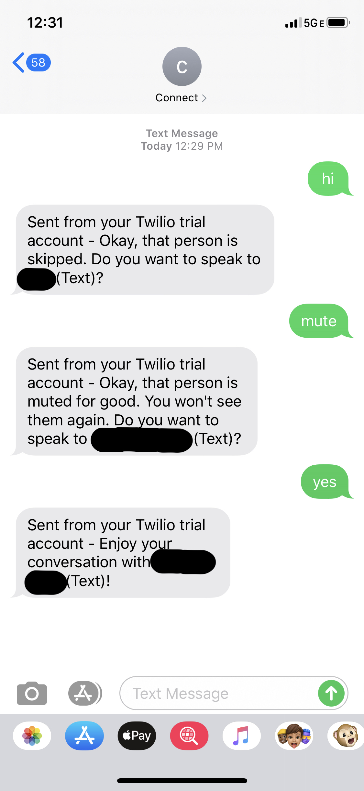

# Connect ⚡️
Connect is a lightweight chat bot to help me keep in touch with my less frequented friends. 

The application currently supports 4 different commands:

- `hi` to begin the conversation and suggests a friend to call. 

- `yes` to accept this suggestion and record the current date.

- `no` to skip this person for a later time.

- `mute` to remove the person from the table

Connect is built using Twilio, Flask, Heroku, and Airtable. 

Twilio serves as the SMS proivder, which is powerved via a webhook to the Flask server on Heroku. The server also interacts directly with [Airtable](http://airtable.com/), which functions as the database.

Data was sourced from Google Contacts, iCloud Contacts, and my Facebook Friends List. Live connection to these sources is a To-Do for the future.

